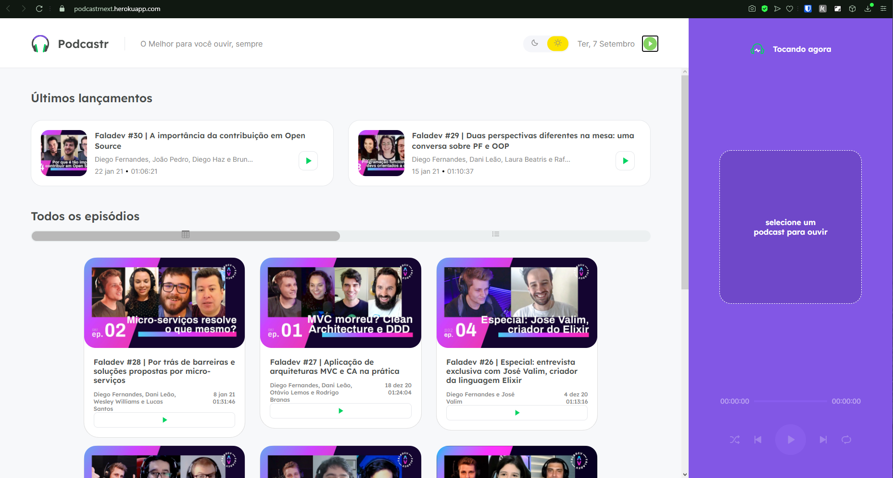
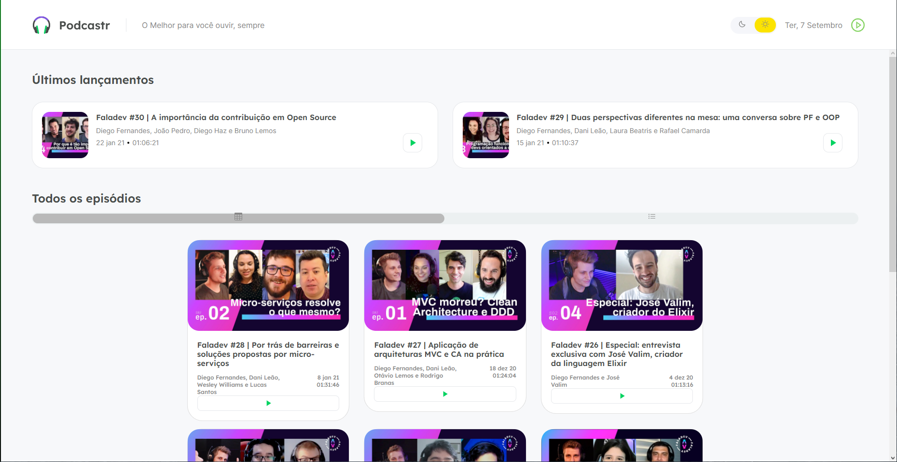
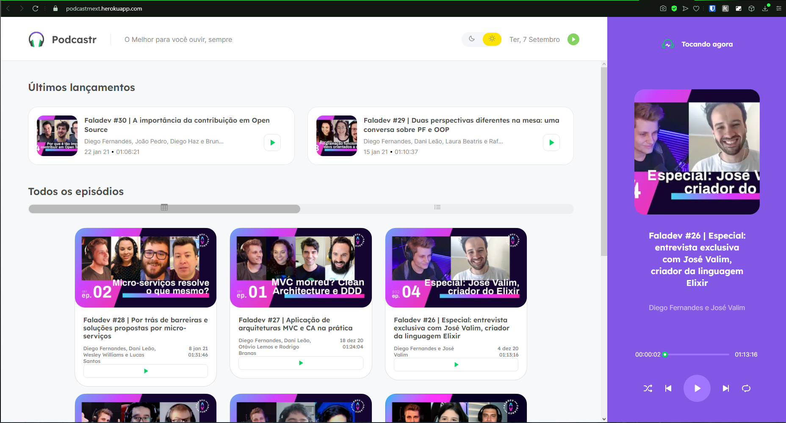
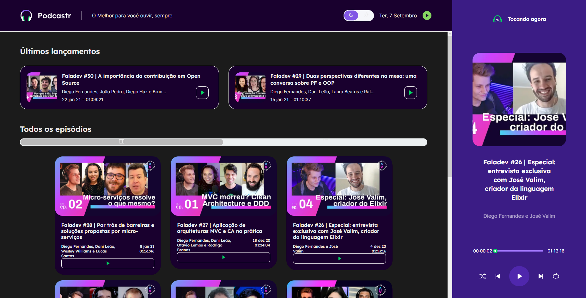
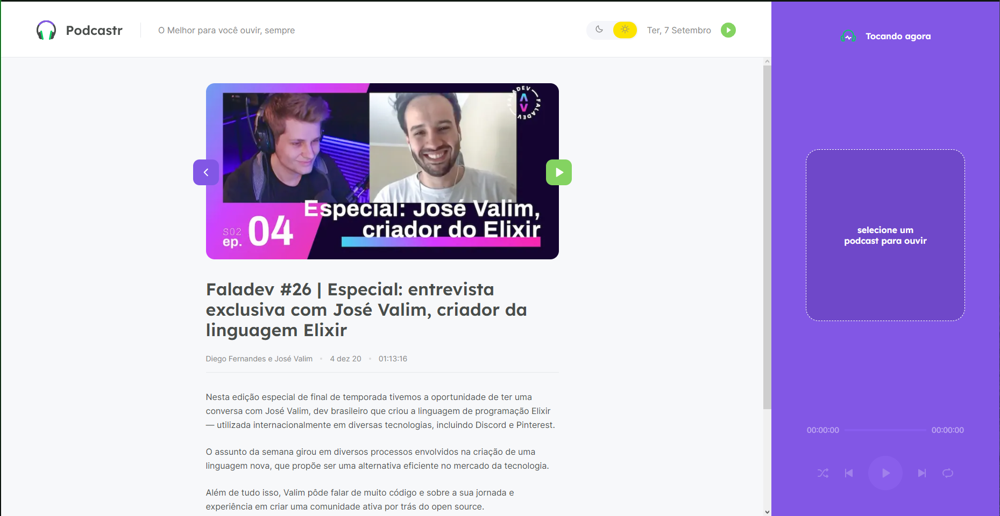

# podcastr
App reprodutor de podcast em Next.
Plataforma desenvolvida durante a semana NLW#5 da [ROCKETSEAT](https://rocketseat.com.br)
Mas foram desenvolvidas algumas funcionalidades a mais:
- darkmode (com switch para mudança)
- responvidade para celulares
- recolhimento do player (com botão para mudança)
- apresentação em lista e em cards

## Demo
[Demostração](https://podcastrnext.herokuapp.com) disponivel no site do heroku

##Instalação 
Para instalar bastar baixar e rodar o comando
```
npm install
```
para instalar todos os pacotes necessários 

## Run
Rodar localmente primeiramente rode o comando 
```
npm run server
```
Em seguinda de start no next
```
npm run start
```
## Imagens do frontend
Tela inicial



Tela Inicial com player recolhido



Tela Inicial com player tocando um podcast



Tela Inicial com player tocando um podcast em darkmode



Tela de detalhe de uma posdcast


para mais detalhes acesse a demostração
